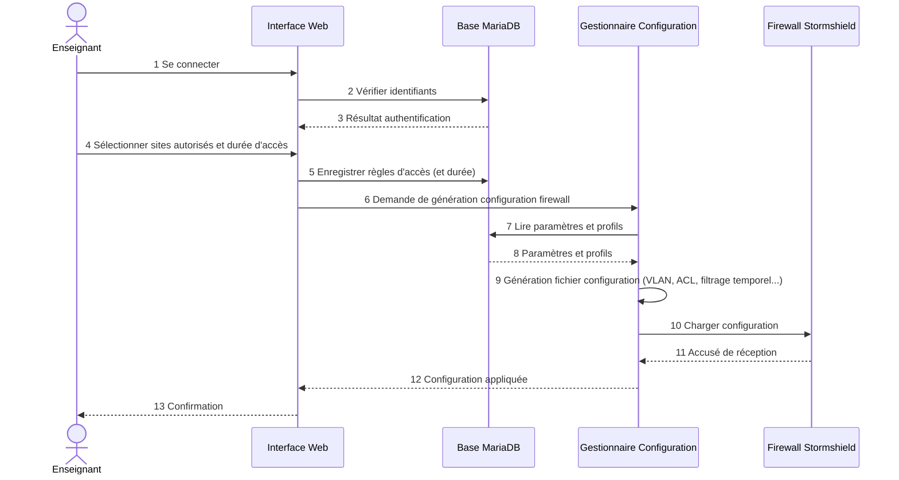
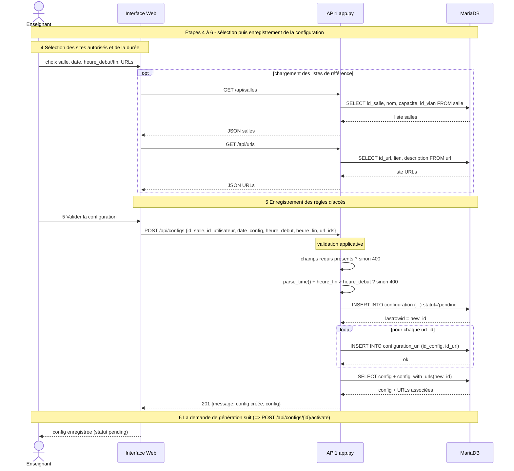
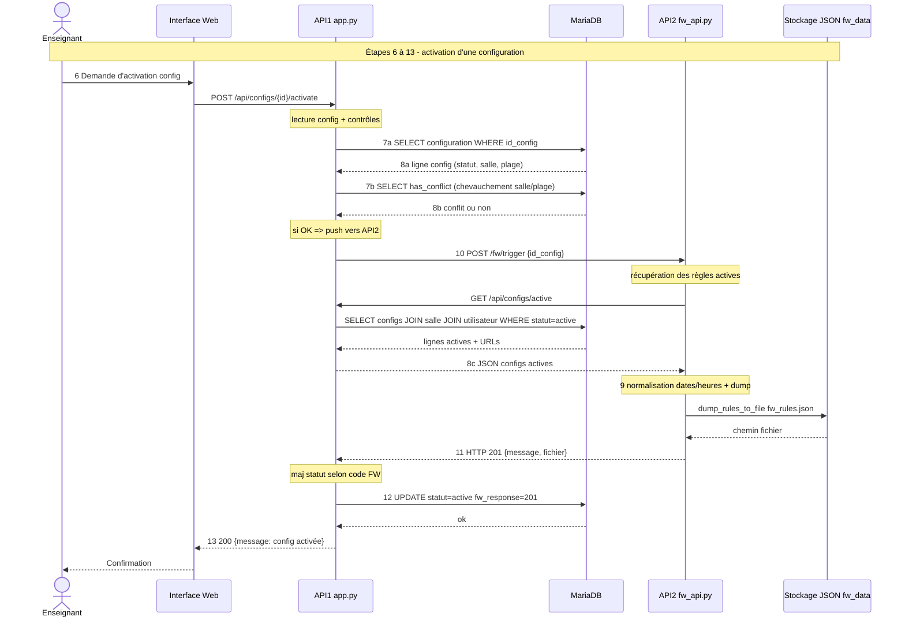

## Introduction

## Lancement des daemons

> [!NOTE]
> - TODO Creer services systemd pour lancer chaque API sur sa VM.

### API Configuration (port 5000)


> [!IMPORTANT]
> Les variables d'environnement ci-dessous doivent être déclarées (une fois par shell) AVANT le lancement de l'appli.

```bash
# Adresse de la DB MySQL
export DB_HOST='localhost'
# Identifiants connection DB MySQL
export DB_USER='salle_tp_user'
export DB_PASSWORD='moto2015'
# Nom de la DB à utiliser
export DB_NAME='salle_tp'
```

```bash
# Lancement de l'appli ds le framework Flask
python3 app.py
```

---

### API Firewall (port 5001)

Les variables d'environnement ci-dessous doivent être déclarées:
```bash
# URL de l'API1 (Configuration) utilisé pour tirer la config
export API1_URL=http://localhost:5000
# Chemin pour le stockage du fichier de config JSON des régles FW
export FW_RULES_DIR=/opt/salle_tp/fw_data
```

```bash
# Lancement de l'appli ds le framework Flask
python3 fw_api.py
```
---


## Diagrammes de séquence de l'application

### Diagramme original du CDC


### Diagramme de l'implementation

#### Détail du cycle de vie d'une régle FW (étapes 4 à 6)

sélection puis enregistrement de la configuration



**Analyse:**

**Étape 4 (sélection)** => ne touche pas en écriture la base.

Cette étape s'appuie sur deux routes de lecture pour construire les listes déroulantes de l'IHM : `GET /api/salles` (`list_salles`) et `GET /api/urls` (`list_urls`), ces deux endpoints font de simples `SELECT ... ORDER BY` sans jointure.


| Action            | Type    | Appel API       | Appel DB                                             |
| ----------------- | ------- | --------------- | ---------------------------------------------------- |
| Lister salles | Lecture | GET /api/salles | `SELECT id_salle, nom, capacite, id_vlan FROM salle` |
| Lister urls | Lecture | GET /api/urls | `SELECT ...` |

Exemple de résultat:

```json=
[
  {
    "id_salle": 1,
    "nom": "Salle 21",
    "capacite": 20,
    "id_vlan": 21
  },
  {
    "id_salle": 2,
    "nom": "Salle 22",
    "capacite": 25,
    "id_vlan": 22
  }
]
```

**Étape 5 → route `POST /api/configs`** (`create_config`). C'est ici que se fait l'enregistrement.

Plusieurs contrôles applicatifs précèdent l'`INSERT` :

- présence des champs obligatoires (`id_salle`, `id_utilisateur`, `date_config`, `heure_debut`, `heure_fin`) sinon `400`.
- `parse_time()` normalise `HH:MM` ou `HH:MM:SS` en `HH:MM:SS`, puis vérification `heure_fin > heure_debut` sinon `400` avant même de tenter d'inserer la régle en base.

> [!NOTE]
> Par sécurité une contrainte du schema de la DB `chk_horaire CHECK (heure_fin > heure_debut)` empêche également de créer une régle .

**L'insertion est en deux temps** : 
- d'abord `INSERT` dans `configuration` avec `statut='pending'` forcé (l'enseignant ne choisit jamais le statut), récupération du `lastrowid` (l'id de la régle créé).
- puis une boucle d'`INSERT` dans la table d'association `configuration_url` pour chaque `url_id` => *(relation n-n)*.

> [!IMPORTANT]
> à l'étape 5, **aucun contrôle de conflit horaire** (fonction `has_conflict()`) n'est fait il est volontairement reporté à l'activation.
> Une config peut donc être créée en `pending` même si elle chevauchera une autre, **le conflit n'est bloquant qu'à l'étape du controle de config** `POST .../activate` (étape 7b) executé avant de générer la config.

---

#### Détail du cycle de vie d'une régle FW (étapes 6 à 13)

activation d'une configuration dans le FW



**Étape 6 → route `POST /api/configs/<id>/activate`** (`activate_config`). C'est le point d'entrée de l'activation, distinct de `POST /api/configs` qui ne fait que créer en statut `pending`.

**Étapes 7-8 (côté API1)** se décomposent en deux lectures DB avant tout appel réseau: le `SELECT` initial sur `configuration`, puis le contrôle `has_conflict()` qui détecte un chevauchement horaire sur la même salle (`heure_debut < %s AND heure_fin > %s`, statut `active`). En cas de conflit => `409`, pas d'appel à API2.

**Étape 10 → `POST /fw/trigger`** : c'est API1 qui appelle API2, avec un `timeout=5`. Si API2 est injoignable => `ConnectionError`, `fw_code=0`, statut `failed`.

**Étapes 7-8 (côté API2)** : `/fw/trigger` rappelle API1 via `GET /api/configs/active` => **API2 ne lit pas la base directement, elle repasse par l'API1 (API2 n'a aucun accès DB). `fetch_active_rules()` transforme ensuite `date_config` et `heure_*` en chaînes pour éviter les soucis de types `datetime.date` / `timedelta` de pymysql.

**Étape 9 → `dump_rules_to_file()`** : écriture du JSON dans `fw_data/fw_rules.json` + cache mémoire `_rules_cache`.

**Étape 11** : API2 répond `201` seulement si fetch configs + dump réussissent.

**Étape 12 → `UPDATE`** : `nouveau_statut = "active" if fw_code == 201 else "failed"`. Le passage à `active` est donc conditionné au code HTTP retourné par API2, comme demandé dans le schéma.

**Étape 13** : `200` si activée, sinon `502` avec le `fw_message`.

NB: la détection « config en cours » (`is_active_now` / route `GET /fw/rules?active=1` etc...) n'intervient pas ici => c'est de l'affichage côté pare-feu, postérieur à l'activation .

---

